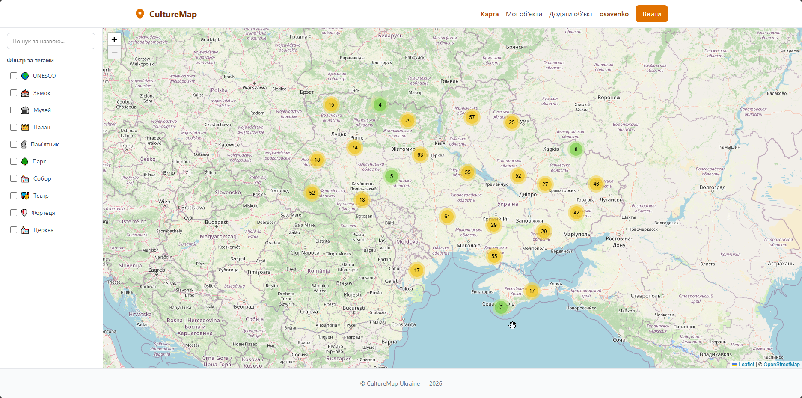
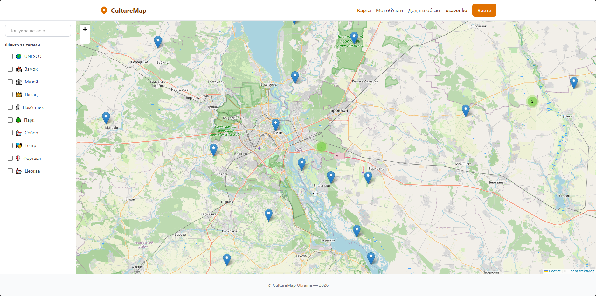
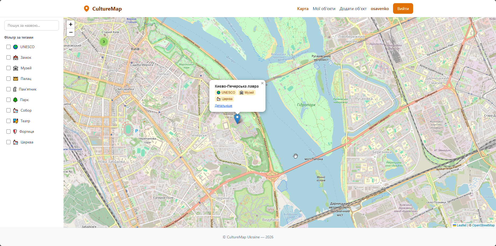
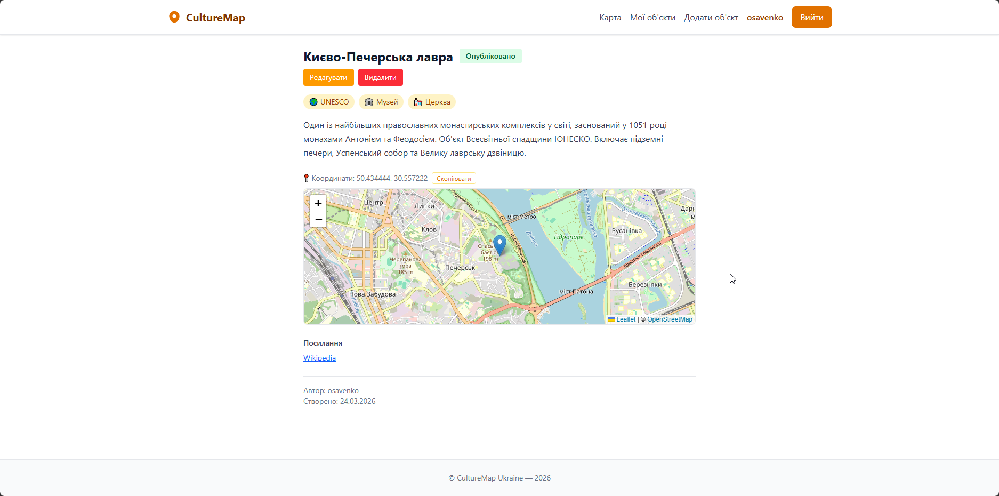
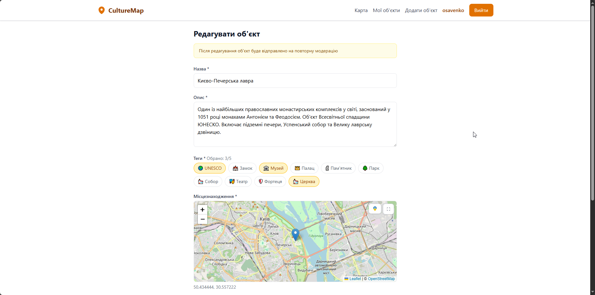
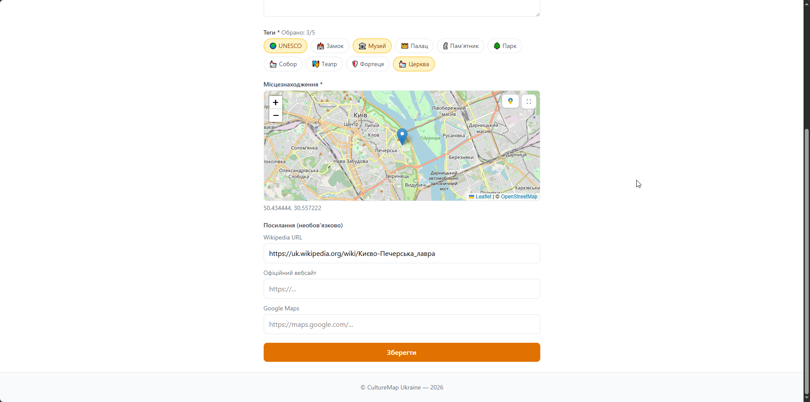
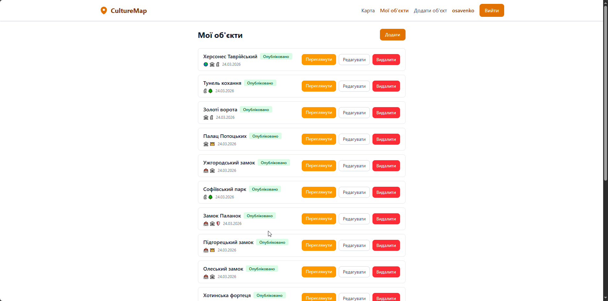
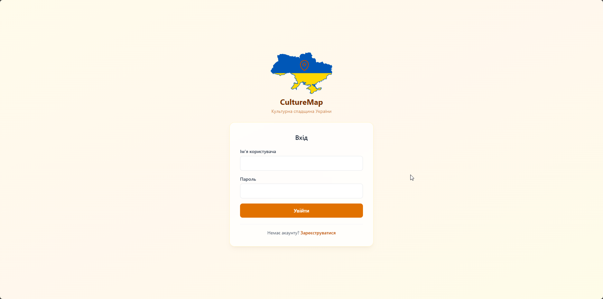
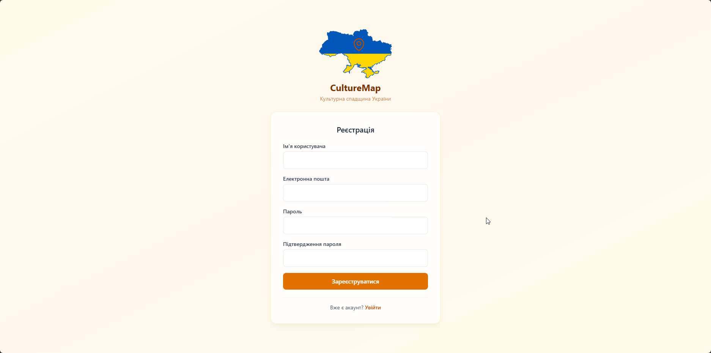

# CultureMap Ukraine

[](https://github.com/Makedoncek/cultural-heritage/actions/workflows/ci.yml)

A web platform for mapping Ukrainian cultural heritage and tourist sites. Registered users submit objects
(castles, churches, monuments, etc.), time-bound events, photos, audio narratives, and tourist routes — all
reviewed by administrators before appearing publicly. The interface is bilingual (Ukrainian / English) with
light and dark themes.

## Features

- **Interactive map** of Ukraine with clustered markers (Leaflet) — light/dark themes (OpenStreetMap tiles for
  light; MapTiler / CartoDB dark tiles for dark)
- **Objects and events** — permanent cultural sites and time-bound events, with automatic archiving of expired events
- **Filtering & search** — by category tags, type (objects / events), event time status; debounced title search
- **Photo gallery** — multiple photos per object stored and transformed via Cloudinary (author and contributor photos)
- **Audio narratives** — in-browser recording (MediaRecorder) or file upload, normalised to MP3 on Cloudinary
- **Tourist routes** — ordered stops, real-road geometry and stop optimization (OpenRouteService), GPX / KML / KMZ
  export, copying public routes, and marking routes completed
- **Multilingual content** — crowdsourced translations (uk / en / pl / de) of objects and routes, with moderation
- **Cultural passport** — visited and planned places with a personal map and statistics
- **Social features** — favourites ("Saved"), following authors with new-content notifications, inaccuracy reports
- **Popular objects** — ranking by number of saves
- **Moderation workflow** — `pending → approved → archived` (plus `rejected` for media/translations, `draft` for routes);
  editing an approved item returns it to review
- **Authentication** — JWT with role-based access (Guest / User / Admin); email verification and password reset sent
  asynchronously via Celery
- **Bilingual UI** (Ukrainian / English) and **light / dark theme**, persisted per user
- **Data integrity** — coordinate validation against the Ukraine border polygon (Shapely) and nearby-duplicate
  detection (Haversine)
- **Admin panel** for moderating all content types and managing tags with multilingual names

## Screenshots

### Map View


*Interactive map of Ukraine with clustered markers and tag filtering sidebar*


*Zoomed-in view showing individual markers*


*Marker popup with object info and quick navigation*

### Object Detail


*Detailed view with description, tags, location map, and links*

### Add / Edit Object



*Object form with tag selection, location picker, and URL fields*

### My Objects


*User's objects with status badges (approved / pending / archived)*

### Authentication

|              Login              |               Register                |
|:-------------------------------:|:-------------------------------------:|
|  |  |

## Tech Stack

| Layer            | Technology                                                                          |
|:-----------------|:------------------------------------------------------------------------------------|
| Frontend         | React 19 + TypeScript + Vite 7 + Tailwind CSS v4 + Leaflet (react-leaflet v5 + cluster) + react-i18next |
| Backend          | Django 5 + Django REST Framework + SimpleJWT + Celery                               |
| Database / Broker| PostgreSQL 15 + Redis 7 (Docker)                                                    |
| Media / Routing  | Cloudinary (images & audio CDN) · OpenRouteService (route geometry)                |
| Map tiles        | OpenStreetMap (light) · MapTiler / CartoDB (dark)                                   |
| Auth             | JWT (access + refresh tokens)                                                       |
| Background tasks | Celery + Redis (email, media cleanup, event archiving)                              |
| CI               | GitHub Actions (backend tests + coverage, frontend lint + build)                   |
| Deployment       | Vercel (frontend) + Render (backend) + Docker (self-hosted)                         |

## Architecture

```
                         ┌──────────────────────────┐
                         │         Browser          │
                         │   (React 19 SPA + map)   │
                         └────────────┬─────────────┘
              HTTPS / JSON            │            tiles · media
        ┌──────────────────────────────┴───────────────┬────────────────┐
        ▼                                               ▼                ▼
┌────────────────────────┐                    ┌──────────────┐  ┌──────────────┐
│ Django + DRF (Gunicorn)│◀──── Celery ──────▶│   Redis 7    │  │  External:   │
│  REST API + JWT + admin│      tasks         │   (broker)   │  │  OSM/MapTiler│
└───────────┬────────────┘                    └──────┬───────┘  │  Cloudinary  │
            ▼                                         ▼          │  OpenRoute…  │
   ┌──────────────────┐                      ┌────────────────┐ │  SMTP        │
   │  PostgreSQL 15   │                      │ Celery worker  │ └──────────────┘
   └──────────────────┘                      │   + beat       │
                                             └────────────────┘
```

## API

REST API under `/api/`. Interactive documentation (Swagger) is available at `/api/docs/`.

| Method    | Endpoint              | Description                           | Auth         |
|:----------|:----------------------|:--------------------------------------|:-------------|
| POST      | `/api/auth/register/` | Register new user                     | No           |
| POST      | `/api/auth/login/`    | Login (JWT tokens)                    | No           |
| POST      | `/api/auth/refresh/`  | Refresh access token                  | No           |
| GET       | `/api/tags/`          | List all tags                         | No           |
| GET       | `/api/objects/`       | List objects (filtering, search)      | No           |
| GET       | `/api/objects/{id}/`  | Object detail                         | No           |
| POST      | `/api/objects/`       | Create object                         | Yes          |
| PUT/PATCH | `/api/objects/{id}/`  | Update object                         | Author/Admin |
| DELETE    | `/api/objects/{id}/`  | Archive object (soft delete)          | Author/Admin |
| GET       | `/api/objects/my/`    | Current user's objects                | Yes          |
| GET       | `/api/routes/`        | List / manage tourist routes          | Mixed        |
| GET       | `/api/health/`        | Health check                          | No           |
| GET       | `/api/docs/`          | Swagger API documentation             | No           |

Additional endpoint groups (see `/api/docs/` for the full list): object photos and audio
(`/api/objects/{id}/photos/`, `/api/objects/{id}/audios/`), route stops and export, content translations,
favourites and author following, visits / planned visits, inaccuracy reports, and user preferences
(`/api/auth/me/preference/`).

## Prerequisites

- Python 3.11+ (production image uses 3.14)
- Node.js 18+ (production image uses 20)
- Docker + Docker Compose (PostgreSQL + Redis)
- *Optional, for full functionality:* Cloudinary, OpenRouteService and SMTP credentials

## Getting Started (Development)

### 1. Clone the repository

```bash
git clone https://github.com/Makedoncek/cultural-heritage.git
cd cultural-heritage
```

### 2. Start PostgreSQL + Redis

```bash
docker-compose up -d
```

### 3. Set up the backend

```bash
cd backend
python -m venv venv
source venv/bin/activate  # Windows: venv\Scripts\activate
pip install -r requirements.txt
```

Create a `.env` file in `backend/`:

```env
SECRET_KEY=your-secret-key
DEBUG=True
DB_NAME=culturemap
DB_USER=postgres
DB_PASSWORD=postgres
DB_HOST=localhost
DB_PORT=5432
CORS_ALLOWED_ORIGINS=http://localhost:5173,http://127.0.0.1:5173
CSRF_TRUSTED_ORIGINS=http://localhost:8000,http://127.0.0.1:8000

# Background tasks (Celery + Redis)
CELERY_BROKER_URL=redis://localhost:6379/0
# Set True to run tasks synchronously without a worker (handy in development)
CELERY_TASK_ALWAYS_EAGER=False

# Optional integrations — features degrade gracefully without them
CLOUDINARY_CLOUD_NAME=
CLOUDINARY_API_KEY=
CLOUDINARY_API_SECRET=
ORS_API_KEY=
EMAIL_HOST_USER=
EMAIL_HOST_PASSWORD=
```

```bash
python manage.py migrate
python manage.py seed_data       # Creates admin, test user, tags, and sample objects
python manage.py runserver
```

To process emails and background jobs, run a Celery worker in a separate terminal
(or set `CELERY_TASK_ALWAYS_EAGER=True` to skip it in development):

```bash
celery -A config worker --loglevel=info
```

### 4. Set up the frontend

```bash
cd frontend
npm install
```

Create a `.env` file in `frontend/`:

```env
VITE_API_URL=http://localhost:8000/api
# Optional: enables MapTiler dark-theme tiles (falls back to CartoDB Dark Matter without it)
VITE_MAPTILER_KEY=
```

```bash
npm run dev
```

## Production Deployment (Docker)

Deploy the full stack with a single command:

```bash
docker compose -f docker-compose.prod.yml up -d --build
```

This starts the containers:

- **db** — PostgreSQL 15 with a persistent volume
- **redis** — Celery message broker
- **backend** — Django + Gunicorn, auto-migrates on startup
- **celery** / **celery-beat** — async task worker and periodic scheduler
- **frontend** — React SPA served by nginx (reverse-proxies `/api` and the admin panel)
- **certbot** — automatic TLS certificate issuance/renewal

To seed data:

```bash
docker compose -f docker-compose.prod.yml exec backend python manage.py seed_data
```

## Development Commands

### Backend

```bash
python manage.py runserver               # Start dev server
python manage.py test objects            # Run tests
python -m coverage run manage.py test objects && python -m coverage report  # Tests with coverage
python manage.py makemigrations          # Create migrations
python manage.py migrate                 # Apply migrations
python manage.py seed_data               # Load sample data (admin/admin123, testuser/testpass123)
celery -A config worker --loglevel=info  # Background task worker
```

### Frontend

```bash
npm run dev        # Start dev server
npm run build      # Production build (runs tsc + vite build)
npm run lint       # ESLint
```

## Project Structure

```
cultural-heritage/
├── backend/
│   ├── config/              # Django settings, URLs, Celery app
│   ├── objects/             # Main app: models, views, serializers, tasks, validators
│   │   ├── data/            # Ukraine border GeoJSON
│   │   ├── services/        # OpenRouteService client, route export (GPX/KML/KMZ)
│   │   ├── management/      # seed_data and maintenance commands
│   │   └── tests/           # Test suite
│   ├── locale/              # Django translations (uk/en)
│   ├── Dockerfile           # Production image (python:3.14-slim + gunicorn)
│   └── manage.py
├── frontend/
│   ├── src/
│   │   ├── components/      # Map, Layout, Objects, Author, Passport, Translation, ...
│   │   ├── pages/           # Home, Detail, Add/Edit, Routes, Saved, Passport, Reports, ...
│   │   ├── services/        # API client and per-domain services
│   │   ├── context/         # AuthContext (JWT), ThemeContext
│   │   ├── i18n/            # react-i18next locales (uk/en)
│   │   └── types/           # TypeScript interfaces
│   ├── Dockerfile           # Multi-stage build (node:20-alpine → nginx:alpine)
│   └── package.json
├── nginx/                    # Reverse proxy config for Docker
├── .github/workflows/ci.yml  # GitHub Actions CI
├── docker-compose.yml        # Development (PostgreSQL + Redis)
└── docker-compose.prod.yml   # Production (db + redis + backend + celery + celery-beat + frontend + certbot)
```

## Test Accounts (seed_data)

| Role  | Username   | Password      |
|:------|:-----------|:--------------|
| Admin | `admin`    | `admin123`    |
| User  | `testuser` | `testpass123` |
